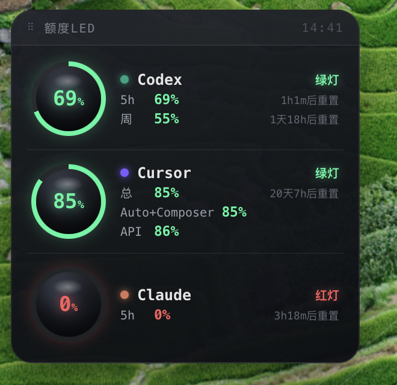

# 额度LED

Mac 桌面挂件：单面板三行（每行左球体+右文字）展示 **Codex / Cursor / Claude Code** 的订阅剩余额度。可拖动、点击启动对应 App。
基于 [Übersicht](https://tracesof.net/uebersicht/)（桌面壁纸层挂件，类似系统的天气/电量小组件）。



## 组成

| 文件 | 作用 |
|------|------|
| `collect.py` | 采集器：读三个服务的额度，输出 JSON（被挂件每 60s 调用一次）|
| `quota.jsx` | Übersicht 挂件：渲染三栏 LED 面板 |
| `statusline.py` | Claude Code statusLine 脚本：把官方 `rate_limits` 写入缓存供 collect.py 读取 |
| `install.sh` | 把本仓库作为「文件夹挂件」软链到 Übersicht widgets 目录 |

## 隐私

全程只在**本机**读取你自己的账号数据，不上传到任何第三方：Codex / Claude 读本地文件；Cursor 只用你本机已登录的凭证请求 Cursor 官方接口。仓库里不含任何 token、密钥或个人路径。

## 数据来源（均为只读自己的账号数据）

| 服务 | 取数方式 | 说明 |
|------|----------|------|
| **Codex** | 本地 `~/.codex/sessions/**/*.jsonl` 里的 `rate_limits` 快照 | 纯本地，无需联网；5h 与 周 两个窗口**各自**显示剩余 % 与重置时间 |
| **Cursor** | `cursor.com/api/usage-summary`（token 取自 `state.vscdb` 的 `cursorAuth/accessToken`）| 显示 **总 / Auto+Composer / API** 三类剩余 % + 计费周期重置 |
| **Claude Code** | statusLine 写入的官方 `rate_limits`；触顶时读取本地 429 `session limit` 记录 | 显示 5h 与周额度；触顶时 5h 直接显示 0%，周额度继续保留 |

### Claude 栏
Claude Code 会把 statusLine 所需的会话 JSON 通过 stdin 传给命令。`statusline.py` 从里面读取：

| 字段 | 显示 |
|------|------|
| `rate_limits.five_hour` | `5h` 剩余百分比与重置时间 |
| `rate_limits.seven_day` | `周` 剩余百分比与重置时间 |

脚本会把这两个官方窗口写到本机缓存：

```text
~/.claude/quota-led-claude.json
```

`collect.py` 优先读取这份缓存，换算成剩余百分比显示在挂件里。这个链路只读 Claude Code 已经提供给 statusLine 的数据，**不需要 token，也不调用第三方接口**。

启用（一次性）：在 `~/.claude/settings.json` 加上
```json
{ "statusLine": { "type": "command",
    "command": "/usr/bin/python3 \"<本仓库绝对路径>/statusline.py\"" } }
```
然后**重启 Claude Code**（或打开一次 `/hooks` 让配置重载）。之后你每次用 Claude Code，官方额度就会刷新到缓存，挂件 Claude 栏即显示真实余额。

如果 Claude Code 已经触顶，Claude 本地日志里会出现 `You've hit your session limit · resets ...` 的 429 记录。`collect.py` 会读取这条记录，把 `5h` 剩余显示为 **0%**，并按提示里的重置时间显示倒计时；如果 statusLine 缓存里已有 `seven_day`，周额度会继续显示。

> `rate_limits` 通常要在 Claude Code 会话完成一次模型请求后才会出现在 statusLine 输入里。刚启用或刚打开 Claude Code 时，如果还没有数据，Claude 栏会显示暂无数据。

## 安装

```bash
brew install --cask ubersicht          # 若未安装 Übersicht
git clone <repo> quota-led && cd quota-led
./install.sh                           # 把本目录软链为 widgets/quota-led
```

> `install.sh` 软链整个目录，`quota.jsx` 与 `collect.py` 同处一地；挂件命令用
> `$HOME/Library/Application Support/Übersicht/widgets/quota-led/collect.py`，不含任何个人路径。
> 若你把挂件目录改名（非 `quota-led`），相应改 `quota.jsx` 顶部 `command` 里的路径。

挂件默认出现在桌面**左下角**（壁纸层，在窗口下面——按 F11 / Mission Control「显示桌面」可快速查看）。
**拖动标题栏（顶部「⠿ 额度LED」那条）可移动位置**，位置记在 Übersicht 的 localStorage，刷新/重启不丢。

## 交互：点击卡片启动 App

点任意一张卡，用 Übersicht 的 `run()` 执行 `open -a <App>` 拉起/置前对应应用：

| 卡片 | 启动 | Bundle ID |
|------|------|-----------|
| Codex | `open -a Codex` | com.openai.codex |
| Cursor | `open -a Cursor` | com.todesktop.230313mzl4w4u92 |
| Claude | `open -a Claude` | com.anthropic.claudefordesktop |

改启动目标：编辑 `quota.jsx` 顶部的 `APP` 映射。
> 若点击没反应：确认 Übersicht 没开「忽略鼠标事件 / click-through」（菜单栏 Übersicht 图标里），本挂件需要可交互。

## 颜色 / 状态灯规则

每张卡的球体、进度环、明细数字都按**剩余百分比**着色（`quota.jsx` 的 `ledColor()`）：

| 剩余 | 颜色 | 状态灯 |
|------|------|--------|
| ≥ 50% | 绿 `#36f6a0` | 绿灯 |
| 20% ~ 50% | 黄 `#ffd23f` | 黄灯 |
| < 20% | 红 `#ff5d5d` | 红灯 |
| 无数据 | 灰 `#5a5f6a` | 无数据 |

- 判断依据是**剩余**（= 100 − 已用），不是已用。
- 每个值独立判色：球体按 headline（Codex/Claude 用 5h 剩余、Cursor 用总剩余）；明细每行按各自剩余。
- 阈值想改就改 `ledColor()` 里的 `50` / `20`。

## 自定义

- **位置**：默认左下角；**拖标题栏**可移动，位置存 localStorage（键 `quotaLedPos_v2`），刷新/重启不丢。想重置回左下角，在 Übersicht 控制台执行 `localStorage.removeItem("quotaLedPos_v2")` 后刷新。
- **布局**：单面板三行，每行左球右字。面板宽度在 `Panel` 的 `width: 288`，球体大小在 `Orb` 的 `size` 默认值。
- **刷新频率**：改 `refreshFrequency`（毫秒）。
- **配色阈值**：改 `ledColor()`（默认 ≥50% 绿、≥20% 黄、否则红）。

软链安装下改仓库文件即时生效（刷新 Übersicht）；改了 `className` 等加载期配置需重启 Übersicht。

## 调试

```bash
/usr/bin/python3 collect.py | python3 -m json.tool   # 直接看采集结果
```
> 注意用 `/usr/bin/python3`（系统自带，Übersicht 实际调用的就是它）。
